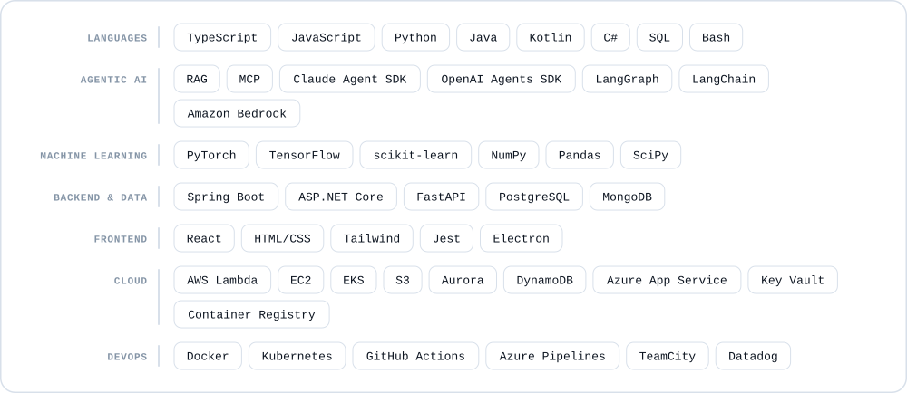
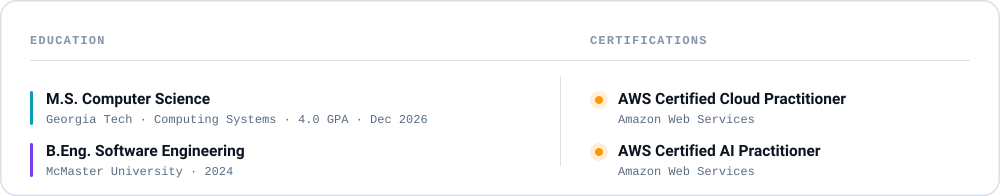
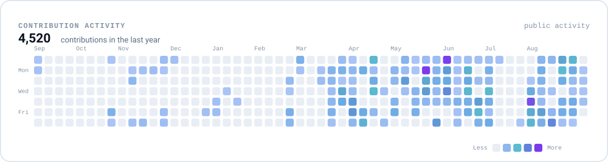

<!--
  This README is generated in part. The SVG cards in assets/ are rendered by
  .github/scripts/render.py and refreshed daily by .github/workflows/profile.yml.
  Edit copy here; edit card content in .github/scripts/render.py.

  NOTE: the contribution card already includes private contributions, because
  "include private contributions on my profile" is enabled on the account.
  If that setting is ever turned off, add a repository secret named
  METRICS_TOKEN (a PAT with the read:user scope) to restore the full count.
-->

<picture>
  <source media="(prefers-color-scheme: dark)" srcset="assets/hero-dark.svg">
  <source media="(prefers-color-scheme: light)" srcset="assets/hero-light.svg">
  
</picture>

<!-- kept on one line: GitHub turns single newlines inside an HTML block into   -->
   

I build production systems where the AI **is** the product — agentic pipelines, retrieval that holds up against real documents, and the platform work that keeps both running. Full-stack by training, focused on agentic AI at Guidewire, and finishing an M.S. in Computing Systems at Georgia Tech.

---

<picture>
  <source media="(prefers-color-scheme: dark)" srcset="assets/stack-dark.svg">
  <source media="(prefers-color-scheme: light)" srcset="assets/stack-light.svg">
  
</picture>

<picture>
  <source media="(prefers-color-scheme: dark)" srcset="assets/credentials-dark.svg">
  <source media="(prefers-color-scheme: light)" srcset="assets/credentials-light.svg">
  
</picture>

<picture>
  <source media="(prefers-color-scheme: dark)" srcset="assets/activity-dark.svg">
  <source media="(prefers-color-scheme: light)" srcset="assets/activity-light.svg">
  
</picture>

---

 

**Open to conversations about full-stack and agentic AI work.**

<a href="https://www.linkedin.com/in/daniel-akselrod">LinkedIn</a> · <a href="mailto:dakselrod@outlook.com">dakselrod@outlook.com</a>

