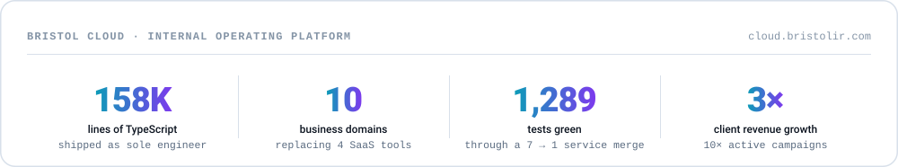
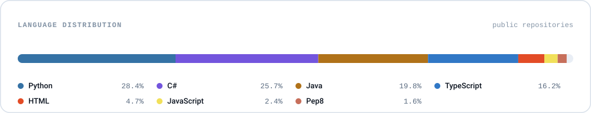

<!--
  This README is generated in part. The SVG cards in assets/ are rendered by
  .github/scripts/render.py and refreshed daily by .github/workflows/profile.yml.
  Edit copy here; edit card content in .github/scripts/render.py.

  NOTE: the contribution card counts PUBLIC activity only unless a repository
  secret named METRICS_TOKEN (a PAT with the read:user scope) is set. With it,
  private contributions are included.
-->

<picture>
  <source media="(prefers-color-scheme: dark)" srcset="assets/hero-dark.svg">
  <source media="(prefers-color-scheme: light)" srcset="assets/hero-light.svg">
  
</picture>

<!-- kept on one line: GitHub turns single newlines inside an HTML block into   -->
  

I build production systems where the AI **is** the product — agentic pipelines, retrieval that holds up against real documents, and the unglamorous platform work that keeps both running. Right now that means shipping AI features at Guidewire by day and running a 158K-line platform single-handed by night.

---

### Currently

**Guidewire** — *Software Engineer II*  
AI product work on an AWS / Spring Boot / React stack. Led AI enablement sessions for 100+ engineers across the Toronto office.

**Bristol Cloud** — *Sole engineer* · [cloud.bristolir.com](https://cloud.bristolir.com)  
An internal operating platform spanning 10 business domains — billing, CRM, campaigns, IR screening — that replaced four third-party SaaS tools.

<picture>
  <source media="(prefers-color-scheme: dark)" srcset="assets/impact-dark.svg">
  <source media="(prefers-color-scheme: light)" srcset="assets/impact-light.svg">
  
</picture>

- Collapsed a 7-service micro-frontend architecture into a modular monolith — retiring 8 Azure App Services, cross-service HTTP hops, shared internal API keys, and Module Federation — without dropping a test.
- Ships as git-SHA-tagged container images to Azure App Service for single-command rollback, with Key Vault managed-identity secrets and schema-per-domain Postgres isolation across 77 migrations.
- Exposes platform tools to an in-app AI assistant over an OAuth-secured **MCP server**.

---

### Stack

<picture>
  <source media="(prefers-color-scheme: dark)" srcset="assets/stack-dark.svg">
  <source media="(prefers-color-scheme: light)" srcset="assets/stack-light.svg">
  
</picture>

---

### Selected public work

Most of what I ship lives in private repositories. A sample of what doesn't:

| Project | What it is |
| --- | --- |
| **[rag-engine](https://github.com/d-akselrod/rag-engine)** | Retrieval-augmented generation API on FastAPI, FAISS, and Gemini — semantic search and grounded chat over a local vector store, no external database required. |
| **[sweat-smart](https://github.com/d-akselrod/sweat-smart)** | Full-stack mobile fitness app. React front end, ASP.NET Core API, Azure-hosted. |
| **[cab-pool](https://github.com/d-akselrod/cab-pool)** | Full-stack Android ride-sharing app in TypeScript. |
| **[python3-pseudo-compiler](https://github.com/d-akselrod/python3-pseudo-compiler)** | Translates Python 3 into PEP/9 assembly by walking the AST. |

---

### Activity

<picture>
  <source media="(prefers-color-scheme: dark)" srcset="assets/activity-dark.svg">
  <source media="(prefers-color-scheme: light)" srcset="assets/activity-light.svg">
  
</picture>

<picture>
  <source media="(prefers-color-scheme: dark)" srcset="assets/languages-dark.svg">
  <source media="(prefers-color-scheme: light)" srcset="assets/languages-light.svg">
  
</picture>

---

### Education

**M.S. Computer Science** — Georgia Institute of Technology · Computing Systems · 4.0 GPA · expected Dec 2026  
**B.Eng. Software Engineering** — McMaster University · 2024  
**AWS** — Certified Cloud Practitioner · Certified AI Practitioner

 

**Open to conversations about full-stack and agentic AI work.**

<a href="https://www.linkedin.com/in/daniel-akselrod">LinkedIn</a> · <a href="mailto:dakselrod@outlook.com">dakselrod@outlook.com</a>

